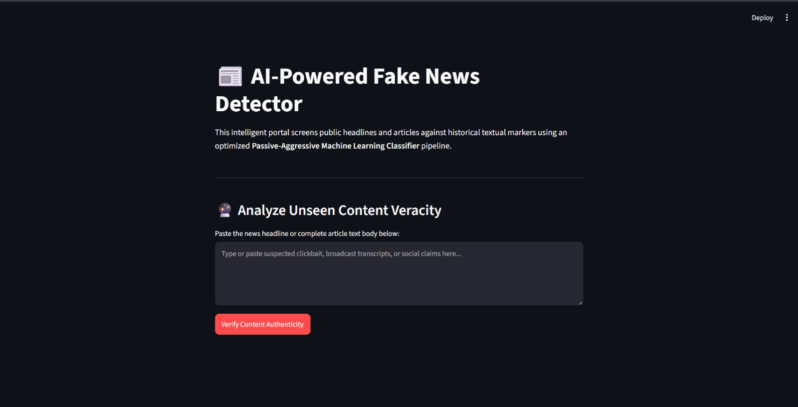
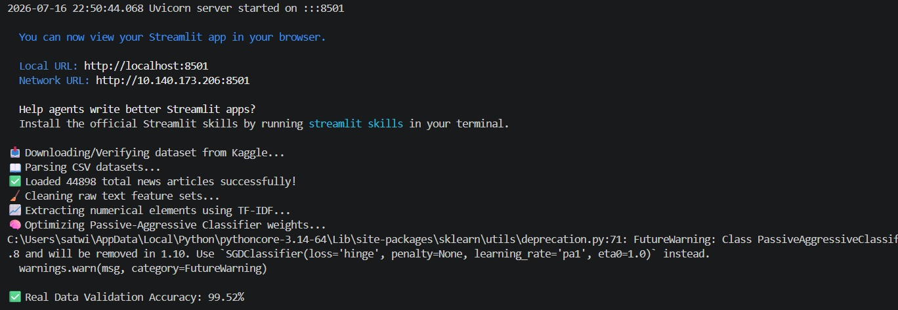
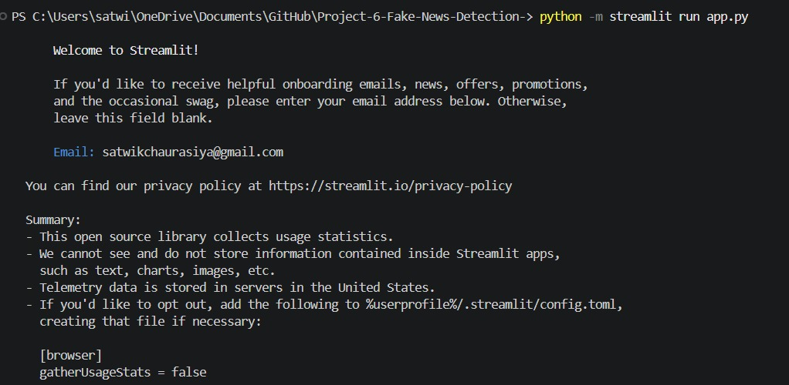

📰 Project: Fake News Detection
🛠️ Codebase Overview
1. app.py
Builds the reactive frontend UI utilizing Streamlit. It loads the model, caches resources to prevent redundant training, displays status messages, accepts raw user input via a text area, and outputs the prediction with clear, color-coded styling based on the classification.

Core UI Components: Custom titles, descriptions, spinner states, toasts for user feedback, metrics panels, and semantic status banners (st.error for Fake, st.success for Authentic).
2. model_pipeline.py
Handles the backend data science workflow:

get_real_dataset(): Downloads the emniyetm/fake-news-detection-datasets dataset from Kaggle via kagglehub, extracts the subfolder files, aligns them into a single pandas DataFrame, and pre-cleans the text feature sets.
train_fake_news_model(): Sets up an 80/20 train-test split, extracts numerical features using a TF-IDF vectorizer, trains a Passive-Aggressive Classifier (max iterations = 50), and reports model performance metrics.
predict_news_veracity(): Preprocesses single input strings through the sanitization pipeline, vectorizes them, and runs model predictions to return the final classification verdict.
3. text_cleaner.py
A modular text sanitization script. It pre-compiles regex patterns (HTML cleaner, URL cleaner, non-alphabetic character cleaner, and duplicate whitespace cleaner) to run highly optimized string operations across large Pandas DataFrames without compiling regex on every iteration.

🌟 Key Features
Real-time Inference: Instantly evaluates user-submitted text and outputs binary classification (Fake or Authentic).
Efficient Vectorization: Utilizes Term Frequency-Inverse Document Frequency (TF-IDF) to convert raw textual content into meaningful numerical features.
Stateful Optimization: Implements Streamlit's built-in caching (@st.cache_resource) to guarantee that model compilation and dataset parsing happen exactly once, saving substantial overhead on subsequent re-runs.
Highly Optimized Preprocessing: Eliminates regex compilation bottlenecks across ~45,000 articles using vector-based pre-compiled substitutions.
📸 Interface & Results
WhatsApp Image 2026-07-17 at 9 27 16 AM WhatsApp Image 2026-07-16 at 10 57 00 PM WhatsApp Image 2026-07-16 at 10 57 00 PM (1)
📂 Project Structure
├── app.py                  # Streamlit frontend user interface
├── model_pipeline.py       # Core dataset ingestion, training, and prediction logic
├── text_cleaner.py         # Regex-optimized text preprocessing script
├── requirements.txt        # Package installation list
└── README.md               # Documentation
⚙️ Installation & Setup
Prerequisites
Python 3.10+
A Kaggle API token (if using kagglehub for dataset downloading, ensure your credentials are set up locally).
1. Clone the Repository
git clone [https://github.com/Diyaasrivastava43/Fake-News-Detector.git](https://github.com/Diyaasrivastava43/Fake-News-Detector.git)
cd Fake-News-Detector
2. Install Dependencies
Ensure you have the required libraries installed:

pip install streamlit pandas scikit-learn kagglehub
3. Run the Streamlit Application
Start the development server:

python -m streamlit run app.py
After starting, the console will print your access URLs:

Local URL: http://localhost:8501
Network URL: [http://10.140.173.206:8501](http://10.140.173.206:8501)
📊 Model Performance Metrics
The underlying machine learning core evaluates data with the following structure:

Algorithm: Passive-Aggressive Classifier
Data Validation: 80% Training Split / 20% Evaluation Split
Dataset Volume: ~45,000 processed news documents
Evaluation Outputs: Real-time updates display accuracy score, confusion matrix metrics, and categorization latency via the local console stream upon environment launch.
🔍 How It Works
Bootstrapping the Pipeline: When you launch the web application, the backend automatically verifies and downloads the Kaggle dataset if it isn't already present locally.
Training Phase: The pipeline parses the CSV files, merges and shuffles ~45,000 articles, cleanses the raw text, vectorizes it using TF-IDF, and trains the Passive-Aggressive Classifier model.
Interactive Testing: Paste any news headline or full article body inside the text box. The model processes the input text through the sanitization pipeline, transforms it using the pre-fitted TF-IDF matrix, and instantly outputs a classification verdict.

 
 
 # Project-Fake-News-Detection-

🛠️ Codebase Overview
1. app.py
Builds the reactive frontend UI utilizing Streamlit. It loads the model, caches the resource to prevent redundant training, displays status messages, gets raw user input from a text area, and outputs the prediction with clear styling based on classification.

Core UI Components: Custom titles, descriptions, spinner states, toasts for feedback, metrics panels, and semantic status banners (st.error for Fake, st.success for Authentic).

2. model_pipeline.py
Handles the backend data science workflow:

get_real_dataset(): Downloads the emineyetm/fake-news-detection-datasets dataset from Kaggle via kagglehub, extracts the subfolder files, aligns them into a single pandas DataFrame, and pre-cleans the text feature sets.

train_fake_news_model(): Sets up an 80/20 train-test split, extracts numerical elements using a TF-IDF vectorizer, trains the Passive-Aggressive Classifier (max iterations = 50), and reports model performance.

predict_news_veracity(): Preprocesses single input strings through the preprocessing pipeline, vectorizes them, and runs model predictions to return the classification verdict.

3. text_cleaner.py
A modular text sanitization script. It pre-compiles regex patterns (HTML cleaner, URL cleaner, non-alphabetic character cleaner, and duplicate whitespace cleaner) to run extremely fast string operations across large Pandas DataFrames without compiling regex on each iteration.

⚙️ Installation & Setup
Prerequisites
Python 3.10+

A Kaggle API token (if using kagglehub for dataset downloading, ensure your credentials are set up)

1. Clone the Repository
Bash
git clone [https://github.com/Diyaasrivastava43/Fake-News-Detector.git](https://github.com/Diyaasrivastava43/Fake-News-Detector.git)
cd Fake-News-Detector
2. Install Dependencies
Ensure you have the required libraries installed:

Bash
pip install streamlit pandas scikit-learn kagglehub
3. Run the Streamlit Application
Start the development server:

Bash
python -m streamlit run app.py
After starting, the console will print your local URL:

Bash
Local URL: http://localhost:8501
Network URL: [http://10.140.173.206:8501](http://10.140.173.206:8501)
🔍 How It Works
Bootstrapping the AI Brain Engine: When you launch the web application, the backend automatically verifies and downloads the Kaggle dataset if it isn't present locally.

Training Phase: It parses the CSV files, merges and shuffles ~45,000 articles, cleanses the text, vectorizes using TF-IDF, and trains the model.

Interactive Testing: Paste any news headline or full article body inside the text box. The model runs the input text through the sanitization pipeline, transforms it using the pre-fitted TF-IDF matrix, and outputs a classification verdict instantly.
"""

